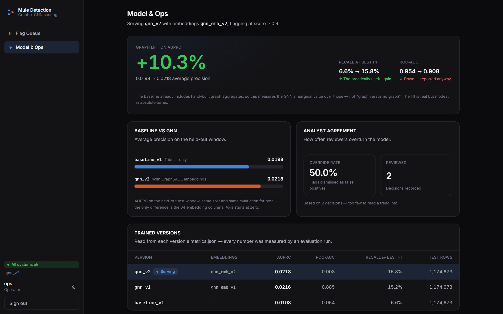
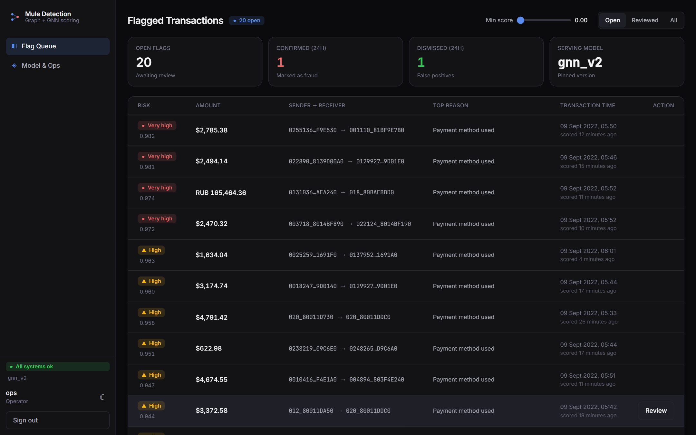
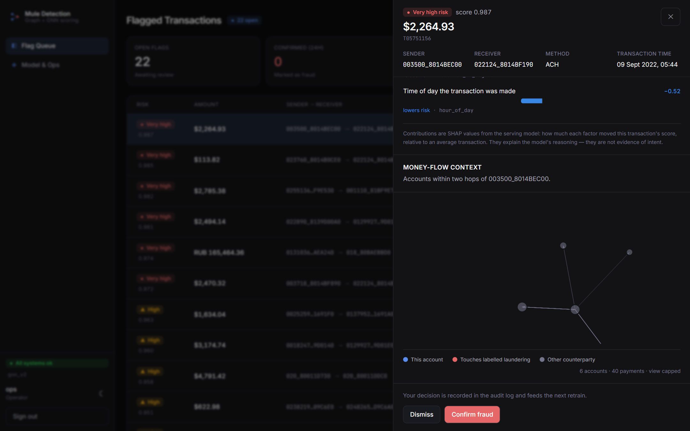
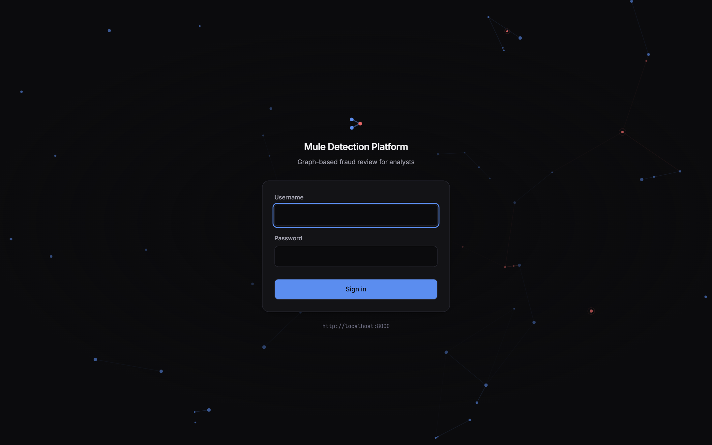

# Graph-Based Fraud & Mule Detection Platform

Real-time money-laundering detection that models accounts and payments as a **graph**, learns account risk embeddings with a **GraphSAGE GNN**, fuses them into an **XGBoost** classifier for sub-second transaction scoring, explains every flag with **SHAP**, and closes the loop with analyst feedback.

Built end-to-end: streaming ingestion → graph store → offline GNN → online scoring API → analyst dashboard.

<p align="center">
  
</p>

---

## The headline result

The point of this project is a measured claim, not a demo that looks clever. Same held-out test window for both models (2022-09-09 onward, **1,174,673 transactions, 802 laundering**), same eval script, same classifier settings — the *only* difference is 64 GraphSAGE embedding columns:

| Metric | `baseline_v1` (tabular) | `gnn_v2` (+ embeddings) | Change |
|---|---|---|---|
| **AUPRC** (headline) | 0.0198 | **0.0218** | **+10.3%** |
| Recall @ best-F1 | 6.6% | **15.8%** | **2.4×** |
| Precision @ best-F1 | 5.1% | 5.7% | +11% |
| F1 | 0.0575 | 0.0837 | +45% |
| ROC-AUC | 0.954 | 0.908 | **−4.8%** |
| Random-guess AUPRC | 0.00068 | 0.00068 | — |

**Read that honestly — the dashboard does, and so should this README.**

- The graph helps, and the recall gain at a usable operating point (6.6% → 15.8% of laundering caught) is the practically meaningful part for an analyst queue.
- But the AUPRC lift is **+10% relative / +0.002 absolute** — real, not dramatic.
- And **ROC-AUC got worse**. That isn't a contradiction: ROC-AUC is dominated by the vast negative class and flatters both models, which is exactly why AUPRC is the headline metric. Quoting the recall gain without the ROC-AUC drop would be cherry-picking, so the UI shows them side by side.

Three caveats that make this a deliberately **conservative** comparison:

1. **The baseline already contains hand-built graph features** (degree, distinct counterparties). So this measures the GNN's *marginal* value over those — not "graph vs no graph at all", which would look far more impressive and be far less honest.
2. The GNN trained on **CPU with untuned settings** (2 layers, 32 dims, 12 epochs to a loss plateau). More capacity may do better.
3. `payment_format` dominates both models and is partly a dataset artifact (ACH carries 73.2% of labelled laundering). Kept in deliberately — dropping an available feature to weaken the baseline would inflate the GNN's apparent lift.

Both models are weak in absolute terms. That is expected: laundering here is *structural*, and a single account-level embedding only partially captures it.

---

## Screens

| Flag queue | Flag detail |
|---|---|
|  |  |
| Risk-ordered worklist. Reviewed flags leave the queue; the summary strip counts over the whole audit log, not the page. | Plain-language SHAP explanation (diverging bars: red raised the score, blue lowered it) above a live 2-hop money-flow neighbourhood from Neo4j. |

<p align="center">
  
</p>

---

## Architecture

A **modular monolith** with a hard offline/online split. GNN inference never touches the request path — the live path only *reads* precomputed embeddings, which is both how real fraud systems work and what makes sub-second scoring achievable.

```
OFFLINE (batch, GPU-capable)                ONLINE (live, <1s)
────────────────────────────                ──────────────────────────────────────────
IBM AML LI-Small (6.9M tx)                  Producer ──► Redpanda ──► Consumer
        │                                                                │
        ▼                                            ┌───────────────────┤
  Neo4j graph                                        ▼                   ▼
  705,907 accounts                              Neo4j upsert       POST /score
  6,924,049 payments                            (consumer owns      │
        │                                        graph writes)      │  XGBoost + SHAP
        ▼                                                           │  reads pinned
  GraphSAGE ──► account embeddings ─────────────────────────────────┤  embeddings
  (64-dim, versioned artifacts)                                     ▼
        │                                                    Postgres audit log
        ▼                                                           │
  XGBoost (tabular + embeddings) ───────────────────────────────────┤
                                                                    ▼
                                                          React dashboard
                                                       (JWT, queue → detail
                                                        → confirm/dismiss)
                                                                    │
                                                                    ▼
                                                          feedback ──► retrain
```

**Design decisions worth calling out:**

- **Accounts are nodes, transactions are edges.** Labels live on edges; the GNN learns account-level risk from money-flow structure.
- **Model versions are pinned, never `latest`** — a bad retrain cannot silently reach production.
- **Graceful degradation over crashing.** Missing embedding → neutral default + `embedding_version: "missing"`. Neo4j down → scoring is unaffected (it reads artifacts, not the graph) and only the dashboard's graph panel degrades, with a visible banner.
- **Time-slice, never random-sample.** Random sampling severs money-flow chains — the exact structure the GNN needs.
- **Leakage-free features.** Account statistics are `fit` on the training window and `applied` at serve time, so a time-split cannot leak future information backwards.

---

## Tech stack

| Layer | Choice |
|---|---|
| **API** | FastAPI, Pydantic, SQLAlchemy + psycopg |
| **Frontend** | React 19, TypeScript, Vite, Tailwind v4, Motion, TanStack Query, d3-force |
| **GNN** | PyTorch + PyTorch Geometric (GraphSAGE) |
| **Classifier** | XGBoost, scikit-learn |
| **Explainability** | SHAP (TreeExplainer) |
| **Graph store** | Neo4j |
| **Relational** | PostgreSQL |
| **Streaming** | Redpanda (Kafka API) |
| **Auth** | JWT (PyJWT) + bcrypt; static API key for service-to-service |
| **Infra** | Docker Compose, uv, ruff, pytest |

---

## Quickstart

Requires Docker Desktop, Python 3.11 and Node 20.

```bash
# 1. Infrastructure
docker compose up -d neo4j postgres redpanda

# 2. Python deps
uv sync

# 3. Data + models (see "Regenerating artifacts" — these are not in git)
uv run python -m src.graph.build_graph
uv run python -m src.models.classifier.train_baseline
uv run --group gnn python -m src.models.gnn.train_graphsage --epochs 12 --version gnn_emb_v2
uv run python -m src.models.classifier.train_baseline \
    --embeddings artifacts/embeddings/gnn_emb_v2/embeddings.parquet --version gnn_v2
uv run python -m src.models.classifier.evaluate --version gnn_v2

# 4. Create dashboard users (password is prompted, never a CLI argument)
uv run python -m src.db.seed_users --username analyst --role analyst
uv run python -m src.db.seed_users --username ops --role operator

# 5. Run it
uv run uvicorn src.api.main:app --port 8000     # API      -> localhost:8000/docs
cd frontend && npm install && npm run dev       # dashboard -> localhost:5173
```

Then replay live traffic — **start the producer first**, the consumer exits after 15s of silence:

```bash
uv run python -m src.streaming.producer --limit 40000 --rate 1200   # shell A
uv run python -m src.streaming.consumer                             # shell B
```

> At the pinned threshold the model flags roughly **0.5% of transactions**, so a short replay legitimately flags nothing. Replay thousands of events, and say which window you used.

### Environment

Copy `.env.example` to `.env`. Two things bite people:

- **Postgres is on host port 5433**, not 5432 — a local PostgreSQL install commonly owns 5432 and Docker *silently fails to publish* rather than erroring.
- **The dashboard must run on port 5173** — it's in the API's CORS allowlist, and Vite is pinned with `strictPort` so a clash fails loudly instead of drifting to 5174 and breaking only in the browser.

---

## API

| Endpoint | Auth | Purpose |
|---|---|---|
| `POST /score` | `X-API-Key` | Score + explain + audit one transaction |
| `GET /health` | open | Per-component status (liveness probes need no credentials) |
| `POST /auth/login` | open | Credentials → short-lived JWT with a role claim |
| `GET /flags` | JWT | Analyst queue: score-ordered, feedback-joined, with summary counts |
| `GET /graph/{account_key}` | JWT | 1–3 hop money-flow neighbourhood from Neo4j |
| `POST /feedback` | JWT | Record confirm/dismiss; becomes retraining labels |
| `GET /models` | JWT | Trained versions, the baseline-vs-GNN lift, override rate, drift status |
| `POST /retrain` | JWT + **operator** | Records a retrain work order + the steps to run |

Two auth mechanisms by design: the stream consumer is a *service* and gets a static API key; the dashboard acts for a *human* and gets a JWT. `/retrain` is role-gated — an analyst calling it gets **403**, not 401, because they are authenticated and simply not permitted.

Interactive docs at `localhost:8000/docs`.

---

## Testing

```bash
uv run pytest tests/ -q        # 109 tests
uv run ruff check src/ tests/
cd frontend && npm run build   # typecheck + production bundle
```

Tests are weighted toward the failure modes that actually threaten this project rather than coverage for its own sake:

- **Train/serve feature consistency** — asserts the serving feature row equals the training row field-for-field. This guards the #1 silent ML bug.
- **Reproducible evaluation** — a test asserts the real artifacts still reproduce the documented +10.3% lift, so the headline claim cannot drift unnoticed.
- **Idempotent replay** — re-streaming transactions that already exist creates zero duplicate graph edges (verified live: edge count held at exactly 6,924,049).
- **Graceful degradation** — the tabular-only path works when embeddings are missing; `/health` answers rather than hanging when Postgres is down.
- **Contract validation** — malformed input returns 422, never 500.

Integration tests skip themselves cleanly when Neo4j or Postgres aren't running.

---

## Performance

| Measure | Result |
|---|---|
| Scoring p95 latency | **34.5 ms** over 100 requests (target: < 1000 ms) |
| Graph neighbourhood query | ~0.3 s for a 2-hop lookup |
| Graph scale | 705,907 account nodes / 6,924,049 payment edges |
| Streaming | 6,000 events consumed and scored, 0 failures, 0 duplicate edges |

---

## Honest limitations

Things a reviewer would find anyway, stated up front:

- **The lift is modest.** +0.002 AUPRC absolute, and ROC-AUC regressed. See the caveats above.
- **The JWT lives in `sessionStorage`.** XSS could steal it. The correct fix is an httpOnly cookie with CSRF protection (or Cognito); that's a backend change beyond this MVP's scope. `sessionStorage` over `localStorage` bounds exposure to the tab's lifetime, and tokens expire server-side in 60 minutes.
- **Drift monitoring is not instrumented yet.** The Ops screen renders an explicit "Not measured" rather than a green light nobody computed.
- **`/retrain` records a work order, it does not train.** GNN training runs offline on GPU by design, so the API has no GPU — the UI says so instead of implying a job started.
- **Schema migrations are minimal.** A small helper adds *nullable* columns at startup and deliberately refuses anything more (NOT NULL, renames, backfills). That refusal is the signal to adopt Alembic.
- **Desktop-first.** This is an internal analyst workstation tool; it degrades to tablet and is not designed for phones.

---

## Regenerating artifacts

The dataset (~650 MB) and all model artifacts are **git-ignored** — regenerate them rather than expecting them after a clone.

- **Dataset:** IBM AML *AMLworld*, **LI-Small** variant (from Kaggle) → `data/raw/LI-Small_Trans.csv`
- **Artifacts:** `artifacts/models/<version>/` and `artifacts/embeddings/<version>/`, produced by the Quickstart training steps.

> PaySim was evaluated first and **rejected on evidence**: a diagnostic on the real file found zero pass-through accounts and zero money-flow chains, so a GNN would have had no structure to learn. IBM AML has 8 labelled laundering patterns and real multi-hop chains (382 accounts both receive *and* forward laundering-labelled money).

GNN commands need `uv run --group gnn` — `pyg-lib`'s wheels are platform- and torch-specific, so it lives in an optional group and a plain `uv sync` uninstalls it.

---

## Project structure

```
src/
├── api/          FastAPI service: scoring, auth, flags, graph context, model registry
├── models/
│   ├── classifier/   XGBoost training, evaluation, SHAP explanation
│   └── gnn/          GraphSAGE graph builder + training
├── features/     Leakage-free feature engineering (fit on train, apply at serve)
├── graph/        Neo4j client, schema, batch loader
├── streaming/    Kafka-API producer + consumer (consumer owns graph writes)
├── db/           SQLAlchemy models, session wiring, user seeding
└── common/       Env-var configuration
frontend/         React dashboard (Vite build, nginx image)
tests/            109 tests; integration tests skip if infra is down
```

---

## License

Not currently licensed for reuse. Built as a portfolio project.
